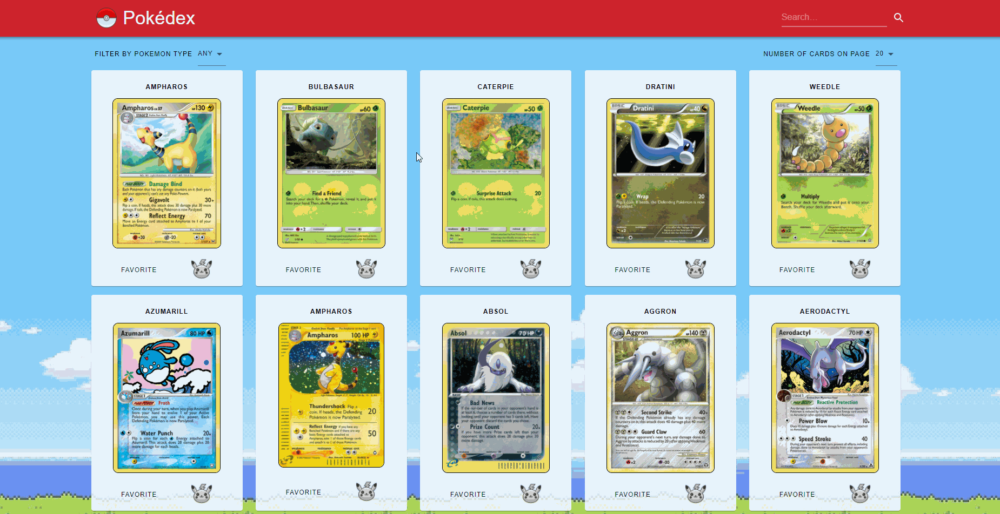

<h1>Pokédex</h1>

    My pokedex project is a simple app that uses pokemon API to fetch and present data about them. 
    It is possible to change number of cards that are being show on the front page. 
    You can: 
    - filter pokemons by type 
    - search by name, type and subtype 
    - add to favorites and search by word "favorites" 

<h5>This project uses:</h5>
<ul>
    <li>React</li>
    <li>Redux</li>
    <li>Material UI</li>
    <li>Pokemon API: https://pokemontcg.io/</li>
</ul>

<h3>To run this app:</h3>
<h5>Go to "pokedex" folder:</h5>
<li>cd pokedex</li>
<h5>Install dependencies by:</h5>
<li>npm install</li>
<h5>and start by:</h5>
<li>npm start</li>

<h1>Search and filter pokemons by type</h1>

<h1>Search by name</h1>

<h1>Check out pokemons' details</h1>

<h1>...and add to favorites ❤️</h1>
